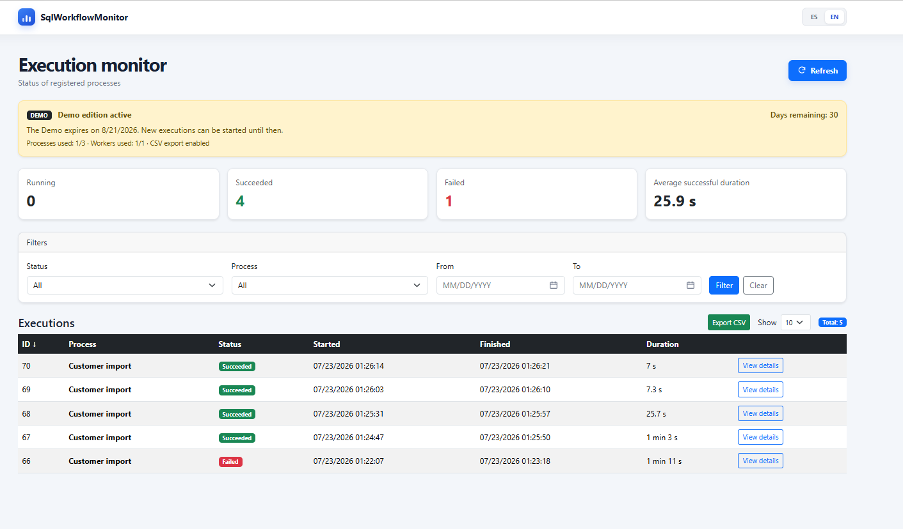
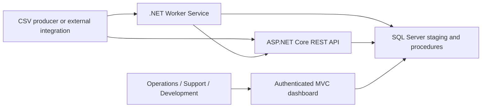
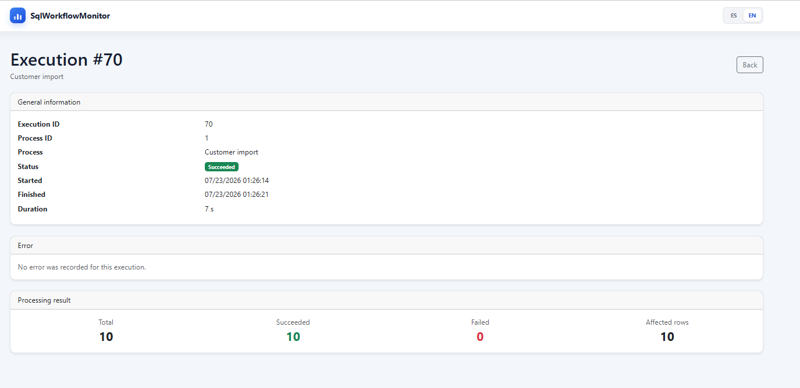
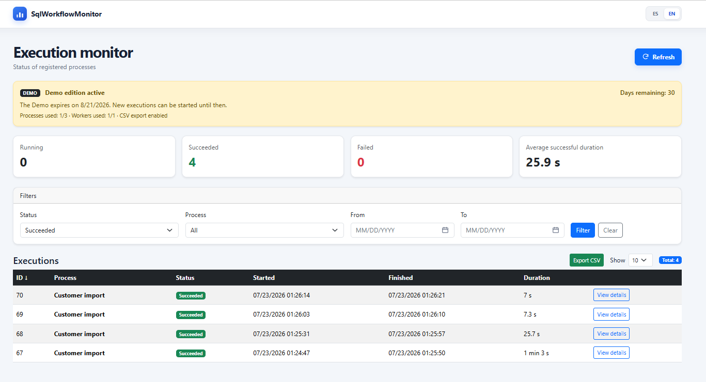

# SqlWorkflowMonitor

**On-premises execution monitoring for .NET backend processes, batch jobs, Worker Services, stored procedures, imports, and data workflows.**

SqlWorkflowMonitor records the lifecycle and operational result of backend executions through a REST API, stores the evidence in SQL Server, and presents it in an authenticated web dashboard for support, development, and operations teams.



## Why it exists

Business-critical backend processes frequently run without a unified operational view. When a batch, integration, Worker, or stored procedure fails—or remains active longer than expected—teams often reconstruct the incident from scattered logs, direct database queries, and manual checks.

SqlWorkflowMonitor centralizes the evidence needed to answer:

- What ran, when, and for how long?
- Is it still running, completed, failed, or cancelled?
- How many items succeeded, failed, or affected data?
- What error was reported?
- Which executions appear stale?
- What happened for a selected process and date range?

## Release status

| Item | Value |
|---|---|
| Source version | `1.1.1` |
| Runtime | .NET 10 |
| Database | SQL Server |
| Public evaluation edition | Demo |
| Deployment model | On-premises / private network |
| Architecture | Modular layered monolith + companion Worker Service |
| Repository model | Proprietary source-available evaluation |

Executable packages are published as GitHub Release assets rather than committed to the source tree.

## Core capabilities

- REST API to start, finish, list, and inspect executions.
- Execution states: `Running`, `Succeeded`, `Failed`, and `Cancelled`.
- Authenticated MVC operational dashboard.
- Local administrator authentication with PBKDF2-SHA-256 password verification.
- API-key authentication for Workers and external integrations.
- Public database-aware health endpoint.
- Server-side filtering, sorting, pagination, and CSV export.
- Detection of stale `Running` executions.
- Processing metrics: total, succeeded, failed, affected rows, and duration.
- Worker Service for controlled CSV ingestion and stored-procedure processing.
- SQL Server staging, transactions, stored procedures, and consistency constraints.
- English and Spanish dashboard localization.
- Safe Problem Details responses, rate limiting, CSP, and defensive browser headers.
- Offline signed-license verification for commercial editions.
- Demo limits enforced transactionally by the application and database.
- Windows Service support for the Web host and Worker.

## Architecture

SqlWorkflowMonitor is intentionally designed as a **modular layered monolith with a companion Worker Service and a shared SQL Server database**.



### `SqlWorkflowMonitor`

ASP.NET Core host containing:

- MVC dashboard and Razor views.
- REST API and Development-only OpenAPI UI.
- Cookie and API-key authentication.
- Licensing and Demo access policy.
- ADO.NET repositories and stored-procedure integration.
- Localization, health checks, exception handling, rate limiting, and security headers.

### `SqlWorkflowMonitor.Worker`

.NET Worker Service containing:

- Scheduled file detection.
- File-age, size, row-count, structure, and data validation.
- Execution lifecycle calls to the API.
- Staging persistence and stored-procedure execution.
- Metrics reporting and processed/error file movement.
- Windows Service hosting.

### Database

The database is managed as code through ordered incremental SQL scripts. `Install.sql` is generated from scripts `001` through `011` and is verified in CI to prevent drift.

See [Architecture](docs/ARCHITECTURE.md), [Database versioning](SqlWorkflowMonitor/SqlScripts/README.md), and [Secure deployment](docs/SECURITY-DEPLOYMENT.md).

## Execution flow

1. A Worker or integration sends `POST /api/executions/start` with its stable identifier.
2. The API authenticates the caller and validates Demo or signed-license access.
3. SQL Server creates a `Running` execution and transactionally applies product limits.
4. The backend process performs its work and collects metrics.
5. The caller sends `POST /api/executions/{executionId}/finish`.
6. SQL Server validates the final state and metrics.
7. An administrator reviews the result, error, duration, stale state, and history in the dashboard.

## Product walkthrough

### Successful execution detail



### Filtered operational history



## Demo and commercial editions

The public evaluation material supports a time-limited Demo edition.

| Restriction | Demo value |
|---|---:|
| Evaluation period | 30 days |
| Distinct monitored processes | 3 |
| Distinct Workers or integrations | 1 |
| CSV export | Enabled |
| After expiration | Read-only |

The limits apply to distinct registered identifiers, not simultaneous executions. After expiration, existing history, details, filters, and enabled exports remain readable; attempts to start new executions return `403 Forbidden`.

Professional and Enterprise license files, private signing keys, the private license generator, customer configuration, and commercial packages are intentionally excluded from this repository.

## Source-available evaluation model

This is a public repository, but **SqlWorkflowMonitor is not open-source software**. The source is made available for technical review, non-production evaluation, defect reporting, and authorized evaluation under the repository license.

The repository license does not permit production use, redistribution, sublicensing, resale, creation of a competing derivative, or removal/bypass of licensing controls. See [LICENSE.txt](LICENSE.txt).

## Requirements

- .NET 10 SDK.
- Visual Studio with .NET 10 support or another compatible development environment.
- SQL Server LocalDB, Developer, or a compatible SQL Server edition.
- SQL Server Management Studio or another SQL client.
- PowerShell for repository setup and verification scripts.

## Local development quick start

### 1. Create the database

Run:

```text
SqlWorkflowMonitor/SqlScripts/Install.sql
```

The checked-in development installer targets `SqlWorkflowMonitor_Dev` and is generated from all numbered scripts.

To verify or regenerate it:

```powershell
./scripts/Build-InstallSql.ps1 -VerifyOnly
./scripts/Build-InstallSql.ps1
```

### 2. Configure development secrets

Run from the repository root:

```powershell
./scripts/Configure-Development.ps1
```

The script:

- prompts for an administrator password;
- generates a random API key;
- derives the administrator password hash and salt;
- stores all values through .NET User Secrets for the Web and Worker projects;
- does not write credentials into versioned configuration files.

### 3. Run the Web application

Open `SqlWorkflowMonitor.slnx` and start the HTTPS profile of `SqlWorkflowMonitor`.

| Resource | Development URL |
|---|---|
| Dashboard | `https://localhost:7072/executions` |
| OpenAPI UI | `https://localhost:7072/swagger` |
| Health | `https://localhost:7072/api/health` |

OpenAPI is intentionally available only in the Development environment.

### 4. Run the Worker

Start `SqlWorkflowMonitor.Worker`. Its Development configuration calls `https://localhost:7072`, reads `Input/customers.csv`, and uses the same API key stored by the configuration script.

A producer should write to a temporary file and atomically rename it to `customers.csv` only when complete. The Worker also waits for the configured minimum file age before processing.

## API

All execution endpoints require:

```http
X-Api-Key: <configured key>
```

| Method | Route | Purpose |
|---|---|---|
| `GET` | `/api/health` | Public API/database availability check |
| `GET` | `/api/executions` | List executions |
| `GET` | `/api/executions/{executionId}` | Get execution detail |
| `GET` | `/api/executions/stuck` | Detect long-running executions |
| `POST` | `/api/executions/start` | Register a new execution |
| `POST` | `/api/executions/{executionId}/finish` | Finish an execution with metrics |

Manual requests are available in `SqlWorkflowMonitor/Requests/SqlWorkflowMonitor.http`.

## Secure deployment baseline

The production template:

- binds Kestrel to `127.0.0.1:5080`;
- disables the Kestrel server header;
- requires non-empty validated API and administrator credentials;
- uses encrypted SQL Server connections without trusting an unverified production certificate;
- rejects a remote Worker API URL that uses plain HTTP;
- applies authentication, anti-forgery, rate limiting, CSP, no-store headers, and safe errors.

For remote access, keep Kestrel private and use a trusted TLS reverse proxy. Do not expose the default HTTP endpoint directly to another machine. See [Secure deployment baseline](docs/SECURITY-DEPLOYMENT.md).

## Reliability behavior

- Invalid execution transitions return `400 Bad Request`.
- Demo or signed-license access violations return `403 Forbidden`.
- Missing or invalid API keys return `401 Unauthorized`.
- Rate-limit violations return `429 Too Many Requests`.
- Database health failures return `503 Service Unavailable`.
- Unexpected failures return safe `500 Internal Server Error` Problem Details without stack traces or SQL internals.
- CSV size, age, row count, header, field length, and email format are validated.
- Lifecycle and metric consistency are enforced in both .NET and SQL Server.
- CSV export neutralizes spreadsheet-formula prefixes.

## Repository quality controls

GitHub Actions verifies that:

- the repository contains no release ZIP, private-key, license, or user-specific project files;
- committed configuration contains no API key or administrator credential;
- `Install.sql` matches scripts `001` through `011`;
- the full solution restores and builds in Release mode with warnings treated as errors;
- security and Worker configuration unit tests pass.

Dependabot is configured for weekly NuGet dependency review.

## Documentation and governance

- [Architecture](docs/ARCHITECTURE.md)
- [Secure deployment](docs/SECURITY-DEPLOYMENT.md)
- [Release process](docs/RELEASE-PROCESS.md)
- [Database versioning](SqlWorkflowMonitor/SqlScripts/README.md)
- [Security policy](SECURITY.md)
- [Support policy](SUPPORT.md)
- [Changelog](CHANGELOG.md)
- [Contribution policy](CONTRIBUTING.md)
- Installation/user manuals and commercial overviews in English and Spanish under `Documentation/Source`
- EULAs and third-party notices under `Legal`

## Contact

- Product and services: [federicostimpfl.com.ar](https://www.federicostimpfl.com.ar)
- Email: `federicosdev@gmail.com`
- LinkedIn: [linkedin.com/in/federicosdev](https://www.linkedin.com/in/federicosdev)
- GitHub: [github.com/stimpfldev](https://github.com/stimpfldev)

## Author

**Federico Stimpfl**

Senior .NET Backend Developer
.NET · SQL Server · APIs · Worker Services · Data & Integrations · Production Reliability
