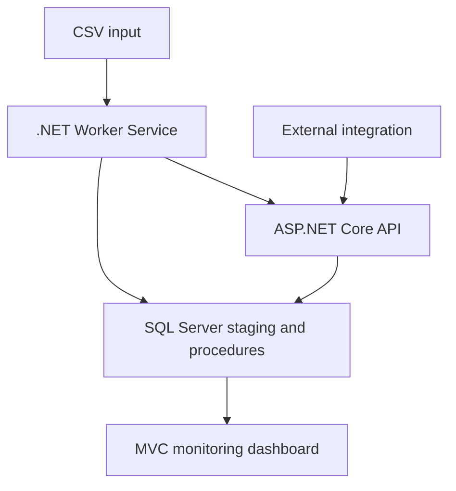

# SqlWorkflowMonitor

Operational monitoring for backend processes, batch jobs, stored procedures, and data workflows.

SqlWorkflowMonitor is a .NET 10 and SQL Server application that records process executions, exposes their lifecycle through a REST API, and gives support and development teams a centralized dashboard for diagnosis.


## Why it exists

Backend jobs often run without a simple operational view. When a process fails, remains active too long, or produces inconsistent results, teams need more than scattered log entries.

SqlWorkflowMonitor keeps the relevant evidence together:

- Current and final execution status.
- Start time, finish time, and duration.
- Total, succeeded, failed, and affected item counts.
- Error details for failed executions.
- Detection of executions running longer than expected.
- Filtered history and CSV export for operational analysis.

## Current status

| Item | Value |
|---|---|
| Current development line | `v1.1` |
| Latest stable release | `v1.1.0` |
| Runtime | .NET 10 |
| Database | SQL Server |
| Available edition | Demo |
| Main branch | `master` |

## Main capabilities

- REST API to start, finish, list, and inspect executions.
- States: `Running`, `Succeeded`, `Failed`, and `Cancelled`.
- MVC dashboard with operational indicators.
- Dashboard authentication using a local administrator account.
- API key authentication for Worker and external integrations.
- Public health endpoint for operational monitoring.
- Web and Worker support execution as Windows Services.
- Filtering by status, process, and date range.
- Server-side pagination and column sorting.
- Execution detail with processing metrics and error information.
- Stale execution detection.
- CSV export using the active filters and sorting.
- Worker Service for scheduled CSV processing.
- SQL Server staging tables and stored procedure integration.
- Database constraints for valid execution transitions and metrics.
- Structured logging and safe Problem Details responses.
- English and Spanish dashboard localization.
- Time-limited Demo rules enforced by the application and database.
- Offline signed license validation for commercial editions.

## Execution flow

1. A Worker or external integration calls `POST /api/executions/start`.
2. The API validates product access and creates a `Running` execution.
3. The process performs its work and collects operational metrics.
4. The integration calls `POST /api/executions/{executionId}/finish`.
5. The dashboard exposes the result for monitoring, filtering, diagnosis, and export.



## Solution architecture

### `SqlWorkflowMonitor`

ASP.NET Core web project containing:

- REST API and OpenAPI documentation.
- MVC monitoring dashboard.
- ADO.NET data access with `Microsoft.Data.SqlClient`.
- SQL Server stored procedure integration.
- Demo and licensed-product access validation.
- Local administrator authentication.
- API key authentication.
- Localization, health checks, logging, and global error handling.

### `SqlWorkflowMonitor.Worker`

.NET Worker Service containing:

- Scheduled CSV file detection.
- Input validation.
- API execution registration with a stable Worker identifier.
- API key authentication.
- Staging persistence and stored procedure execution.
- Metrics reporting.
- Processed and error file management.
- Windows Service execution support.

## Product walkthrough

### Successful execution detail

The detail view connects the execution lifecycle with its processing result: duration, totals, succeeded items, failed items, affected rows, and error information.


### Filtered operational history

Filters, sorting, pagination, and CSV export support focused operational analysis.


### REST API

The API provides explicit endpoints for lifecycle registration, history, stuck execution detection, and detail retrieval.


## Demo edition

The current product build includes a time-limited Demo edition for evaluation.

| Restriction | Demo value |
|---|---:|
| Evaluation period | 30 days |
| Distinct monitored processes | 3 |
| Distinct Workers or integrations | 1 |
| CSV export | Enabled |
| Behavior after expiration | Read-only |

The limits apply to distinct registered identifiers, not simultaneous executions. Previously registered processes and the registered Worker can continue creating executions while the Demo remains active.

After expiration, history, details, filters, and CSV export remain available. Starting a new execution returns `403 Forbidden`.

## Technologies

- .NET 10 and C#.
- ASP.NET Core Web API and MVC.
- .NET Worker Service.
- SQL Server, ADO.NET, and stored procedures.
- `Microsoft.Data.SqlClient`.
- OpenAPI and Swagger UI.
- Bootstrap.
- Git and GitHub.

## Requirements

- Visual Studio 2022 with .NET 10 support.
- .NET 10 SDK.
- SQL Server LocalDB, Developer, or a compatible edition.
- SQL Server Management Studio or another SQL client.

## Quick start

### 1. Create the database

Run:

```text
SqlWorkflowMonitor/SqlScripts/Install.sql
```

For local development, the default database name is `SqlWorkflowMonitor_Dev`.

### 2. Configure the connection

Both projects use `ConnectionStrings:WorkflowMonitor`.

Example for LocalDB:

```json
{
  "ConnectionStrings": {
    "WorkflowMonitor": "Server=(localdb)\\MSSQLLocalDB;Database=SqlWorkflowMonitor_Dev;Integrated Security=True;TrustServerCertificate=True"
  }
}
```

The Worker also requires a stable identifier:

```json
{
  "Worker": {
    "Id": "CustomerCsvWorker"
  }
}
```

The Web application requires local administrator credentials and an API key. The Worker must use the same API key when calling protected endpoints.

Do not commit production passwords, API keys, password hashes, salts, private keys, or other secrets. Use environment variables, user secrets, or ignored local configuration files.

### 3. Run the application

1. Open `SqlWorkflowMonitor.slnx`.
2. Start the `SqlWorkflowMonitor` web project.
3. Start `SqlWorkflowMonitor.Worker` when testing CSV processing.

Default development URLs:

| Resource | URL |
|---|---|
| Dashboard | `https://localhost:7072/executions` |
| Swagger | `https://localhost:7072/swagger` |
| Health check | `https://localhost:7072/api/health` |

## API endpoints

| Method | Route | Purpose |
|---|---|---|
| `GET` | `/api/health` | Validate API and database availability |
| `GET` | `/api/executions` | List executions |
| `GET` | `/api/executions/{executionId}` | Get one execution |
| `GET` | `/api/executions/stuck` | Detect executions running too long |
| `POST` | `/api/executions/start` | Register a new execution |
| `POST` | `/api/executions/{executionId}/finish` | Finish an execution with metrics |

## Validation and reliability behavior

- Invalid execution transitions return `400 Bad Request`.
- Demo access violations return `403 Forbidden`.
- Protected API endpoints require a valid API key.
- Database health failures return `503 Service Unavailable`.
- Unexpected API failures return `500 Internal Server Error` without exposing internal SQL details.
- Metric and lifecycle consistency is validated in both .NET and SQL Server.
- Demo registration limits are transactionally enforced in SQL Server.
- Manual smoke tests are available in `SqlWorkflowMonitor/Requests/SqlWorkflowMonitor.http`.
- Clean installation and Windows Service execution were validated for release `v1.1.0`.

## License

SqlWorkflowMonitor is proprietary software. Viewing the repository does not grant permission to copy, modify, distribute, sublicense, sell, or use it.

See [LICENSE.txt](LICENSE.txt) and [AUTHORSHIP.md](AUTHORSHIP.md).

## Author

Federico Stimpfl
Senior .NET Backend Developer
SQL Server · APIs · Workers · Production Reliability

- [Website](https://www.federicostimpfl.com.ar)
- [LinkedIn](https://www.linkedin.com/in/federicosdev)
- [GitHub](https://github.com/stimpfldev)
